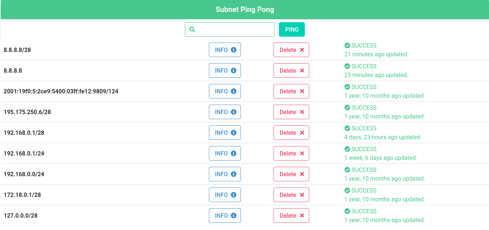

<br>
<p align="center"></p>

<center>

# **Subnet Ping REST API App - Django Rest Framework**

</center>

<br>
<p align="center">
<table>
<tr><td>
</td><td>
</td></tr><tr>
<td colspan="2">
</td></tr>
</table>
</p>
<br />

## Uygulama Özet

<p> 
Dajngo Rest Framework ile rest api subnet  ping uygulaması

Uygulamaya gelen ip isteği üzerine ip adresinin subnet (alt ağlarını) lerini listeliyor.

Bulunan subnet lere ping atılıp ve ip adreslerinin durumuna göre aktif ve aktif olmama durumları log kaydı olarak veriliyor.

- Ipv4 vs ipv6 türündeki ip ler destekleniyor,

- Ipv4 de en küçük subnet tanımı /24 aralığında tanımlandı,

- Ipv6 da en küçük subnet tanımı /120 aralığında tanımlandı. (120 nin altındaki prefixlerde alt ağların pinglenmesi uzun sürdüğünden 120 olarak limit ayarlandı./64 prefixinde çalışması için generator yapı kullanıldı.),

- Gelen ip adresine format kontrolü uygulandı.


Loglar Sqlite veritabanına kaydediliyor ve belirli süre Redis kullanılarak ön bellek te tutuluyor.

Ip isteği, basit bir form arayüzünde ve aynı şekilde log kayıtları da ayrı bir form arayüzünde gösteriliyor.

Cache için Redis kullanıldı , alt ağların durumlarının logları önbellekte belirli süre tutulaması için.

Kuyruk yönetimi için Celery kullanıldı, alt ağlara ping işlemleri için. Celery Broker olarak Rabbitmq kullanıldı.
</p>

<br>

## API Kullanımı

URL= "http://127.0.0.1:8000"

- **URL/api/ip/**

Yeni ip post isteğinde;

POST:

```json
data = {
    'ip': '192.168.0.0/24'
}
```

Post isteğinde yukarıdaki data ile prefixli ip adresi(ipv4/ipv6) isteği atılır ve pingleme işlemi tetiklenir.
ping_task_state boş olarak post isteği yapılıyor.

Daha önce istek yapılmış prefixli ip adresi tekrar post iteği yapldığında güncellenir ve redis-cache verisi silinir.

GET:

Aynı url için get isteğinde tüm prefixli ip adreslerini listeler.

ip_prefix create-post, list-get

- **URL/api/prefix/{id}/**

GET:

Get isteğinde ile prefixli ip adresinin id'si verilerek ip adresi ve alt ağları ile birlikte listelenir.

DELETE:

Delete isteğinde prefixli ip adresinin id'si ile veritabanından ve redis-cache alanından silinir.

A ip_prefix with subnets  list-get, delete-delete

- **URL/api/subnet/{id}/**

GET:

Get isteği ile prefixli ip adresinin alt ağlarından belirlenen bir tanesinin id ile bilgileri listelenir.

A ip subnet get-list
<br/>

## Kullanılan Teknolojiler ve Kurulum
**CELERY**
```bash
python3 -m celery -A subnet_ip_app worker -l info -Q queue1
```
Celery başlatma komutu,

-A: celery uygulamasını içeren modülün adı.

worker -l info: worker ı önplanda çalıştırarak log bilgilerini listeler. 

-Q: task da belirlenen ve çalıştırlması istenen que ismini belirtir.

Kaynak: [realpython](https://realpython.com/asynchronous-tasks-with-django-and-celery/) [celerydoc](https://docs.celeryq.dev/en/stable/userguide/workers.html#starting-the-worker) [celertr](https://www.egehangundogdu.com/celery-nedir-asenkron-gorev-kuyruklarina-giris/)

**RABBITMQ**

```sh
sudo rabbitmqctl add_user myuser mypassword

sudo rabbitmqctl add_vhost myvhost

sudo rabbitmqctl set_user_tags myuser mytag

sudo rabbitmqctl set_permissions -p myvhost myuser ".*" ".*" ".*"
```
Celery için Rabbitmq ayarları.

Rabbitmq ilk yüklemeden sonra celery ile kullanmak için user, virtual host ve kullanıcının sanal hosta erişim yetkisi verilmesi gerekiyor.

```sh
rabbitmq-server
```
Rabbitmq server ının çalıştırılması.
Celery broker olarak rabbitmq ayarlandı.
```sh
sudo systemctl restart rabbitmq-server
```
Rabbitmq server ının yeniden başlatılması.

Rabbitmq tarayıcıdan izlemek için: http://localhost:15672

user: myuser

password: mypassword

Kaynak: [celerdoc-rabbitmq](https://docs.celeryq.dev/en/latest/getting-started/backends-and-brokers/rabbitmq.html#installation-configuration)

**REDIS**
```sh
redis-server
```
Redis server ının başlatılması.
```sh
sudo systemctl restart redis-server
```
Redis server ının yeniden başlatılması.

Redis cache leme  ve celer result backend olarak ayarlandı.

```sh
redis-cli -n 1
```
Redis komut arayüzünü açmak için.
```sh
keys */"pattern"
get "key"
```
Bellekteki keyleri listelemek ve incelemek için.

**HTMX**

HTMX, HTML özniteliklerini kullanarak modern web uygulamaları geliştirmeyi sağlayan bir JavaScript kütüphanesidir. Daha fazla bilgi için [htmx.org](https://htmx.org) adresini ziyaret edebilirsiniz.

**DRF-YASG - SWAGGER-REDOC**

**Swagger Url Adresleri:**
* URL/swagger/
* URL/redoc/
* URL/swagger.json -> swagger.json dosyası Postman e ekleme için kullanılabilir.

Kaynak: [drf-yasg](https://drf-yasg.readthedocs.io/en/stable/readme.html)


## Kurulum
- Python kütüphanelerinin ve bağımlılıkların kurulması.
```bash
pip3 install -r requirements.txt
```
- Model dosyasındaki verilerin migration dosyalarına aktarılması.
```bash
python3 manage.py makemigrations
```
- Migration dosyalarındaki veriler ile veritabaının ve tabloların oluşturulması.
```bash
python3 manage.py migrate
```
- Django Admin için admin kullanıcısı oluşturulması.
```bash
python3 manage.py createsuperuser
```
Uygulamanın çalıştırılması.
```bash
python3 manage.py runserver
```
```sh
redis-server
rabbitmq-server
python3 -m celery -A subnet_ip_app worker -l info -Q queue1
```
## Not:
Dockerfile ve docker-compose.yml dosyaları geliştirme aşamasında...

## Proje Dizin Yapısı
`````
.
├── db.sqlite3
├── django.log
├── docker-compose-old.yml
├── docker-compose.yml
├── .dockerignore
├── Dockerfile
├── dump.rdb
├── .env_bak
├── .env_container
├── .gitignore
├── images
│   ├── demo.gif
│   ├── prefixui.png
│   ├── subnetui.png
│   └── swagger.png
├── manage.py
├── README.md
├── requirements.txt
├── subnet_ip
│   ├── admin.py
│   ├── api
│   │   ├── serializers.py
│   │   ├── urls.py
│   │   └── views.py
│   ├── apps.py
│   ├── __init__.py
│   ├── migrations
│   │   ├── 0001_initial.py
│   │   ├── 0002_alter_ipprefix_ping_task_state.py
│   │   └── __init__.py
│   ├── models.py
│   ├── service
│   │   ├── __init__.py
│   │   └── ping_to_subnets.py
│   ├── static
│   │   ├── main.js
│   │   └── style.css
│   ├── tasks
│   │   ├── __init__.py
│   │   └── ping_to_subnets_task.py
│   ├── tasks2.py
│   ├── templates
│   │   ├── base.html
│   │   ├── index.html
│   │   ├── partials
│   │   │   └── task_state.html
│   │   └── subnet.html
│   ├── tests.py
│   ├── urls.py
│   └── views.py
├── subnet_ip_app
│   ├── asgi.py
│   ├── celery.py
│   ├── __init__.py
│   ├── settings.py
│   ├── urls.py
│   └── wsgi.py
└── wait-for-it.sh
`````
## Kullanılan Teknolojiler

<br>
[Django](https://www.djangoproject.com/)
<br>
<br>
[Django Rest Framework](https://www.django-rest-framework.org/)
<br>

<br>[Redis](https://redis.io/)<br>
<br>
[Celery](https://docs.celeryq.dev/en/stable/getting-started/introduction.html)<br>
<br>
[Rabbitmq](https://www.rabbitmq.com/)<br>

<br>[Htmx](https://htmx.org/)
